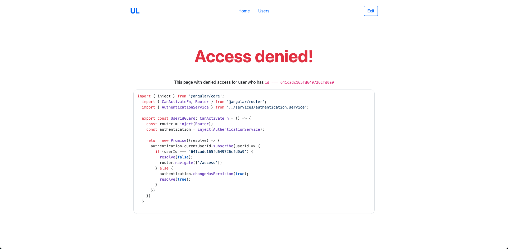
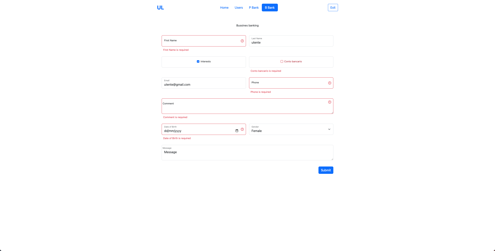
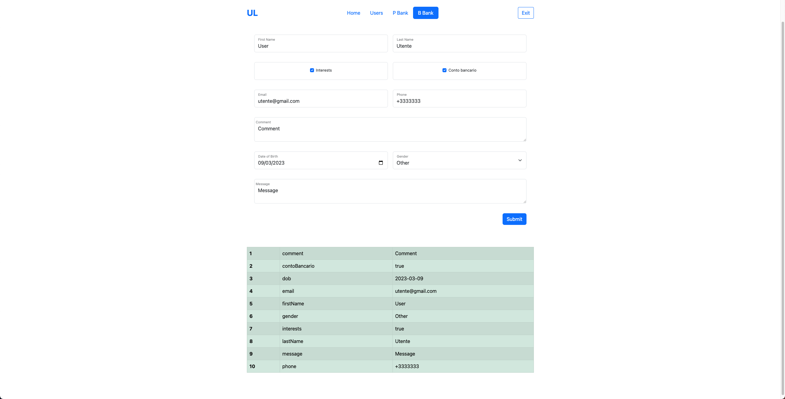

# Angular Users list

## About

[Check Online](https://angular-ul.netlify.app/#/)

In this project i'm learn Angular basics. To create new components, services, guards, pipes, routing. I implementaded login and registration funcuons. Permission logic for special types of users and validaion of existing user when page is reloading.




## Dynamic reactive form builder

In this case i have fake array simulated JSON response. Which contains an array of filters or in another words - inputs. Doesn't matter how many inputs is coming, they should be created thanks to [Angular form builder](https://angular.io/api/forms/FormBuilder) and validated.



Each filter(input) added witch `addControl` method:

```ts
ngOnInit() {
    this.payload.filtri.forEach(filter => {
      if (filter.type === "checkbox") {
        this.bankingForm.addControl(
          filter.name || '',
          this.fb.control('', [Validators.requiredTrue]));
      } else if (filter.element === 'textarea') {
        this.bankingForm.addControl(
          filter.name || '',
          this.fb.control('', [Validators.required]));
      } else if (filter.type === "select") {
        this.bankingForm.addControl(
          filter.name || '',
          this.fb.control('', [Validators.required]));
      } else {
        this.bankingForm.addControl(
          filter.name || '',
          this.fb.control('',
            [Validators.required,
            filter.type === "email" ? Validators.email : Validators.nullValidator,
            filter.type === "tel" ? Validators.pattern('^\\+(?:[0-9] ?){6,14}[0-9]$') : Validators.nullValidator,
            ]));
      }
    });
  }
```

In html file he's associating with inputs form and than controled by [Angular form builder](https://angular.io/api/forms/FormBuilder):

```html
<ng-template [formGroup]="bankingForm" #inputTemplate let-filter="filter" let-bankingForm="bankingForm">
  <div class="col-12 col-md-6">
    <div class="form-floating">
      <input formControlName={{filter.name}}
        [ngClass]="{'is-invalid': submit && bankingForm.controls[filter.name]?.errors}" type={{filter.type}}
        id="{{filter.name}}Grid" placeholder={{filter.placeholder}} value="" class="form-control" aria-label="Input">
      <label for=" {{filter.name}}Grid">{{filter.label}}</label>
    </div>
    <p class="text-danger p-2 m-0">
      {{submit && bankingForm.controls[filter.name].errors ? filter.label + ' is required' : '' }}
    </p>
  </div>
</ng-template>
```


